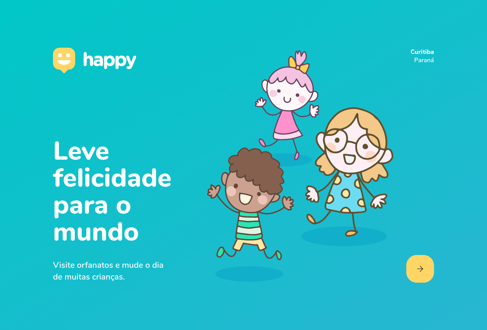
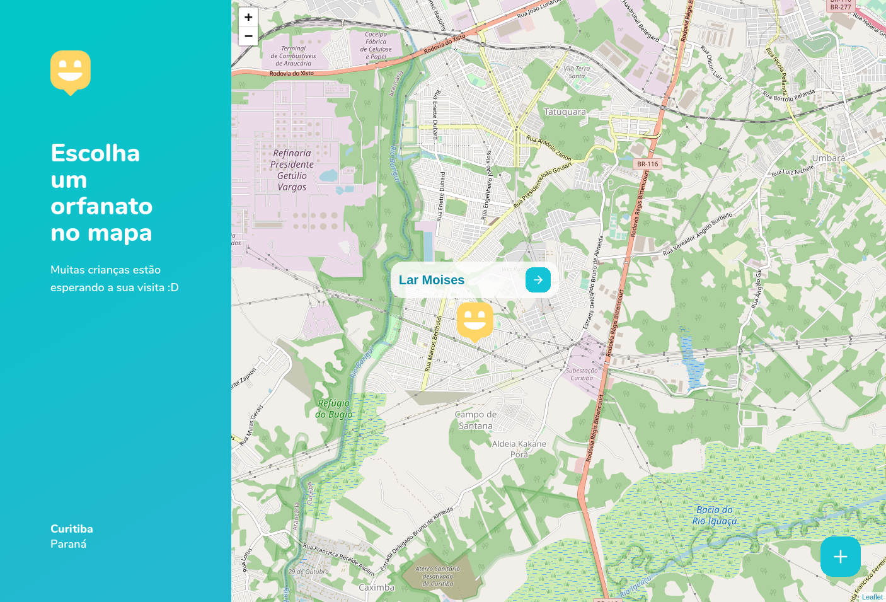
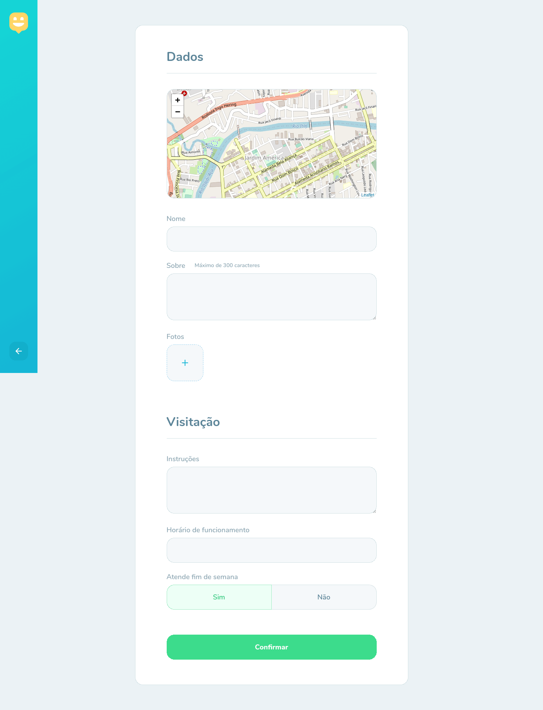
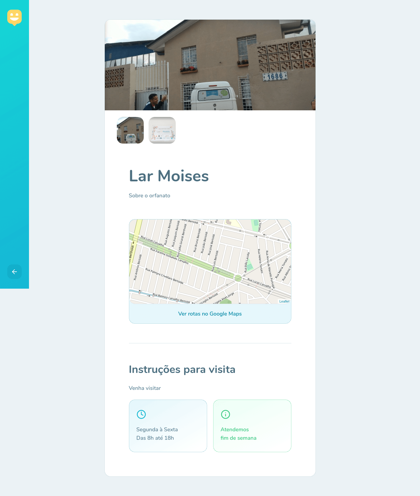
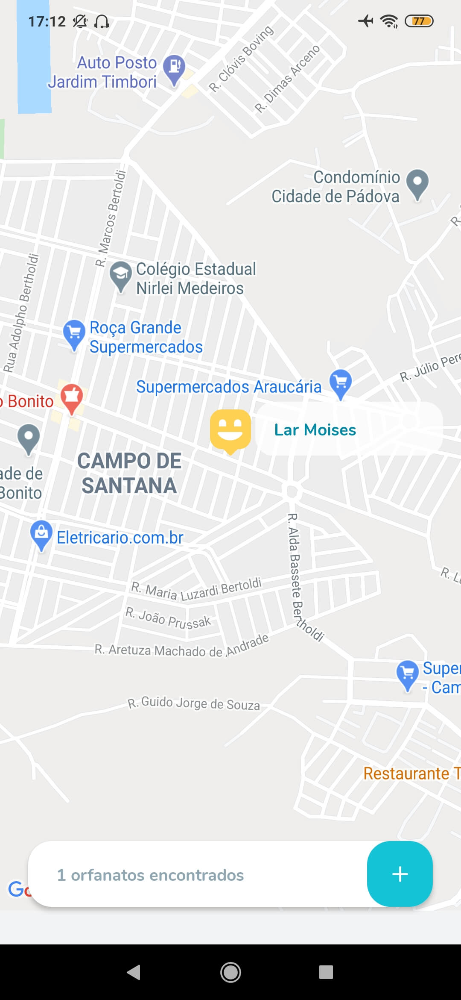
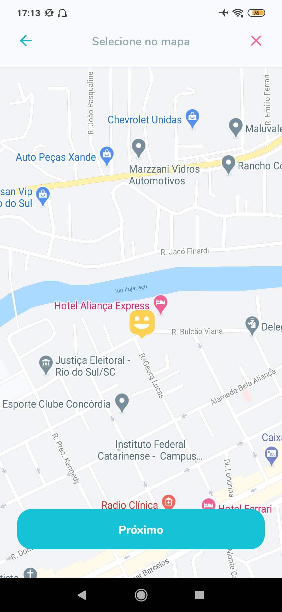
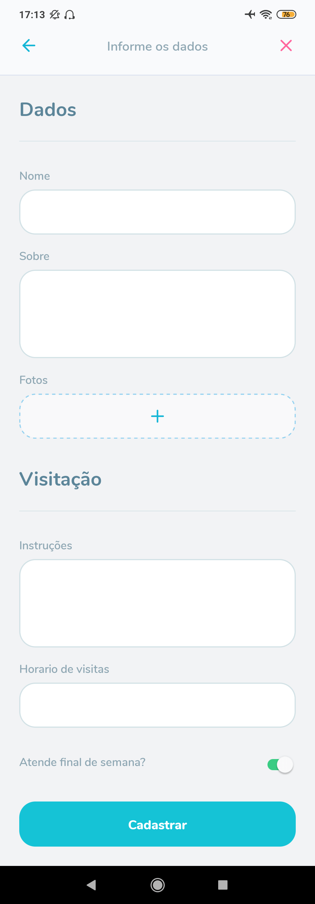
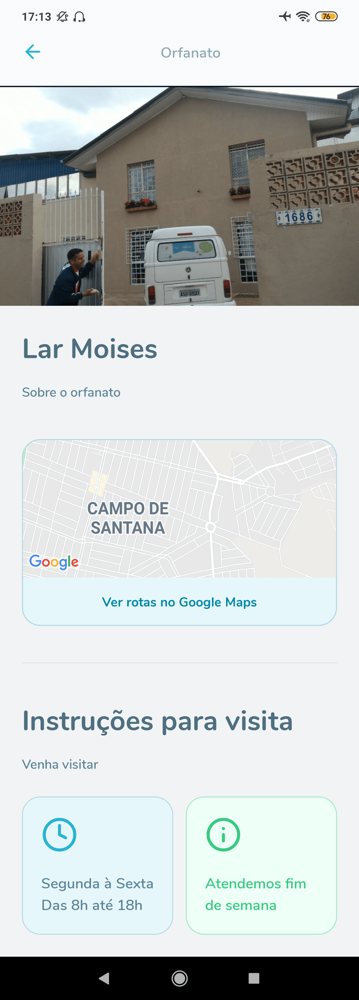

# Rocketseat Next Level Week #3

<h1 align="center">
    
    
    
    
</h1>

<h1 align="center">
    
    
    
    
</h1>

## 💻 Projeto

Projeto desenvolvido no evento "Next Level Week 3" da [Rocketseat](https://rocketseat.com.br/).

O Happy é uma aplicação que conecta pessoas à casas de acolhimento institucional para fazer o dia de muitas crianças mais feliz 💜

## :rocket: Tecnologias

Esse projeto foi desenvolvido com as seguintes tecnologias:

- [Node.js](https://nodejs.org/en/)
- [TypeScript](https://www.typescriptlang.org/)
- [React](https://pt-br.reactjs.org/)
- [React Native](https://reactnative.dev/)
- [Expo](https://expo.io/)

## 🔨 Como usar

Para clonar essa aplicação, você vai precisar de [Git](https://git-scm.com/), Node.js v12 e [Yarn](https://yarnpkg.com/) instalado.

### Iniciar API

```bash
# Diretório da API
cd backend

# Instalar dependências
yarn install

# Rodar migração para criar as tabelas
yarn typeorm migration:run

# Iniciar servidor rodando na porta 3333
yarn dev
```

### Iniciar Frontend

```bash
# Diretório do frontend
cd web

# Instalar dependências
yarn install

# Iniciar aplicação rodando na porta 3000
yarn start
```

### Iniciar Mobile

```bash
# Diretório do mobile
cd mobile

# Instalar dependências
yarn install

# Iniciar aplicação no Expo
yarn start
```

## 🔖 Layout

Nos links abaixo você encontra o layout do projeto web e também do mobile. Lembrando que você precisa ter uma conta no [Figma](http://figma.com/) para acessá-lo.

- [Layout Web](https://www.figma.com/file/mDEbnoojksG4w8sOxmudh3/Happy-Web)
- [Layout Mobile](https://www.figma.com/file/X27FfVxAgy9f5IFa7ONlph/Happy-Mobile)

## 🧠 Desafio

No link a seguir você encontra o guia no Notion referente aos desafios propostos para que você possa percorrer a milha extra e incrementar ainda mais essa aplicação. Lá também você encontra um guia mostrando todo o passo a passo de como realizar o deploy tanto do backend quanto do frontend.

- [Desafio Happy 2.0](https://www.notion.so/Vers-o-2-0-do-Happy-c754db7a4d41469e8c2d00fcf75392c4)

## :memo: Licença

Esse projeto está sob a licença MIT. Veja o arquivo [LICENSE](LICENSE.md) para mais detalhes.

---

<sup>Projeto desenvolvido com a tutoria de [Diego Fernandes](https://github.com/diego3g), da [Rocketseat](https://rocketseat.com.br/).</sup>
